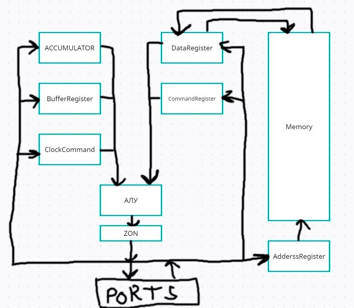

# Архитектура Компьютера, ЛАБ 3

Вариант:
  asm | acc | neum | hw | instr | binary | stream | port | prob2
  
# Язык программирования

```ebnf
  OPERATION: [ADD SYM1, INC, LD SYM2]
  
  VARIABLES: [SYM1: WORD ..., SYM2: WORD ..., COUNTER: WORD ...]
  
  LABELS: [START: ..., FUNC1: ..., STOP: ...]
  
  COMMENTS: [// ...]
```

# Описание:

* Поддержка меток
* Код выполняется последовательно
* В ячейках памяти хранится один тип данных
* Возможность подключать к портам устройства и посылать на них данные

# Система команд:

* Машинное слово - 16 бит
* Доступ к данным осуществляется через AddressRegester. Записать в память происходит через ACC + ALU. Читается в ACC.
* Флаги находятся в АЛУ и выставляются по итогу адрессных операций
* Ввод-вывод организован через порт внутри устройства и инициируется командами
* ClockCommand - счётчик команд, инкрементируется каждую инструкцию и изменяется командами перехода

# Набор инструкций:

* LD: Загрузка в аккумулятор => MEM(x) -> ACC | 5 тактов
* ADD: Сложение => ACC + MEM(X) | 5 тактов
* CMP: Сравнение => Установить флаги по результату ACC - MEM(X) | 5 тактов
* JUMP: Прыжок => X -> CC | 5 тактов
* DROP: Отправка => ACC -> DEVICE(X) | 5 тактов
* BEQ: Переход, если минус => IF N==1 THEN CC + X + 1 -> CC | 5 тактов
* CLA: Отчистка аккумулятора => 0 -> ACC | 4 такта
* INC: Инкремент => ACC + 1 -> AC | 4 такта
* DEC: Декремент => ACC - 1 -> AC | 4 такта
* HLT: Остановка тактового генератора | 4 такта

# Набор инструкций:

* Компилятор возвращает байткод
* 16 бит - одна инструкция

Пример:

```ebnf
 0101000000000111
```
Где:

* Первые 4 байта идентифицируют тип операции
* Остальные 12 идентифицируют либо адрес, либо тип команды

# Транслятор

Этапы трансляции:

* Идентификация переменных кода
* Идентификация наборов инструкций под лейблами
* Парсинг инструкций с подстановкой адресов лейблов и переменных

# Модель процессора



* Все вычисления на АЛУ проходят через ACC
* Ввод вывод происходит через порты
* Машинное слово 16 бит

# CI

```ebnf
name: Test
on: push
jobs:
  test:
    runs-on: ubuntu-latest
    steps:
      - name: Get Repository Code
        uses: actions/checkout@v3
      - name: set up JDK 8
        uses: actions/setup-java@v3
        with:
         java-version: '8'
         distribution: 'temurin'
      - name: Test Result
        run: |
          cd src
          javac -d . *.java
          java Main ./test/code
```

# Вся остальная информация в тестах

| ФИО           | алг.  | LoC | code байт | code инстр. | инстр. | такт. |
|---------------|-------|-----|-----------|-------------|--------|-------|
| Гайдамаков АС | hello | 38  |    296    | 3           | 10     | 62    |                                  
